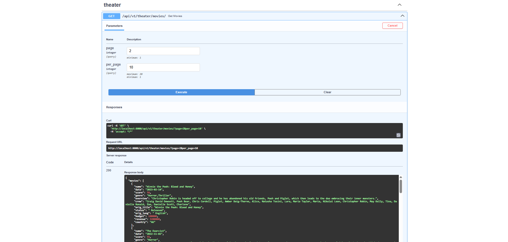
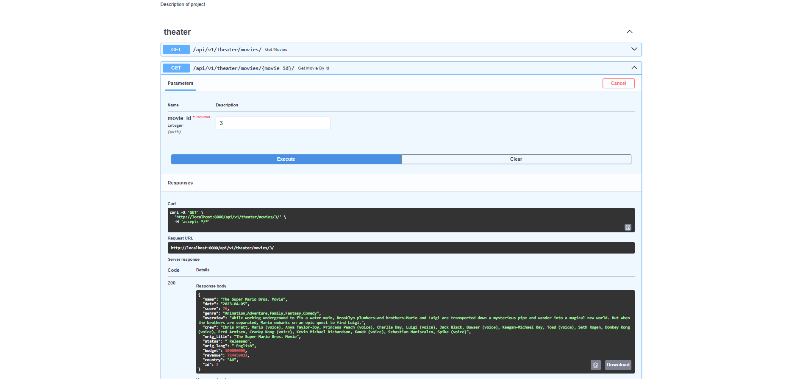

# Cinema API

The API allows users to view information about movies, as well as 
retrieve detailed information about a movie based on its id.

## Installation using GitHub

Uvicorn, FastAPI, SQLAlchemy and Alembic must be already installed

Clone the repository:

```bash
git clone https://github.com/KiporenkoMaksym/py-fastapi-homework-1-task
cd py-fastapi-homework-1-task

Build and start the application with Docker:
docker compose up --build

The FastAPI application will be available at:
http://localhost:8000

API documentation is available at:
http://localhost:8000/docs
```

## Features

- Read movies
- Get specific movies by id

## Demo


